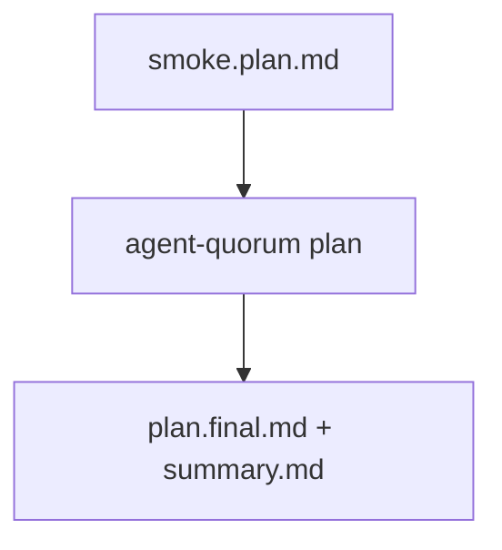

# Smoke-test the agent-quorum plan loop

## At a Glance

- Outcome: confirm the `agent-quorum plan` stage runs one inexpensive end-to-end
  cycle (create → critique → update → final validation → summary) from source.
- Blast radius: no source edits; the run only writes plan artifacts under a
  smoke workdir in `.agents/plans/`.
- Work Plan: two phases — confirm the build/dispatch entry point, then run one
  short low-effort loop with a cheap model matrix.
- Top risk: halt if the selected provider CLI is unauthenticated or the harness
  reports a non-zero exit code.

## Context

This plan exists only to exercise the `agent-quorum plan` path from source after
a change. The system boundary is the local repository and the self-planning
harness, not a product code change. Keep cost low: a cheap model matrix, low
effort, at most two iterations, fix and translate passes off by default.

## Verified Facts

- The umbrella CLI entry point is `src/cli/main.ts`; the plan stage runs through
  `src/stages/plan/run.ts` and parses arguments in `parseRunArgs`.
- `pnpm run plan:self` (`package.json` scripts) runs `tsx src/cli/main.ts plan`
  with `AGENT_QUORUM_PLANS_DIR=.agents/plans`, so artifacts land under
  `.agents/plans/`.
- The default role matrix lives in `agent-quorum.json`; per-role runner, model,
  and reasoning are overridable through `AGENT_QUORUM_<ROLE>_{RUNNER,MODEL,REASONING}`.
- This smoke test requires no public API, bin, schema, config, or runtime
  contract change.

## Target State

A completed smoke run with `plan.final.md` and `summary.md` in the smoke workdir,
a `FINAL:` status of `clean` or `needs-review`, and an exit code of 0. The
tracked source tree stays unchanged except for the generated run artifacts.

## Scope

In scope:

- Confirm the package builds and the `plan` stage dispatches.
- Run the loop with the cheap provider matrix the smoke harness sets.
- Cap iterations low and keep fix/translate off (unless the mode enables fix).
- Inspect the exit code, `plan.final.md`, and `summary.md`.

Non-goals:

- Do not edit source, schemas, skills, docs, config, lockfiles, or generated
  package output.
- Do not stage, commit, push, open a pull request, or publish.
- Do not run broad verification beyond this smoke check.

## Work Plan

| Phase | Work                                                                    | Acceptance                                    |
| ----- | ----------------------------------------------------------------------- | --------------------------------------------- |
| P1    | Confirm `agent-quorum plan --help` dispatches and the build is current. | `plan` usage prints; exit 0.                  |
| P2    | Run one low-effort loop over this prompt with the cheap matrix.         | `plan.final.md` + `summary.md` exist; exit 0. |

## Files and Interfaces

| Surface                    | Role                                           |
| -------------------------- | ---------------------------------------------- |
| `src/cli/main.ts`          | umbrella dispatcher selecting the `plan` stage |
| `src/stages/plan/run.ts`   | plan stage entry point and argument parser     |
| `.agents/plans/<workdir>/` | generated smoke artifacts                      |

## Verification

- `pnpm run smoke:<provider>` completes with exit 0 and writes `plan.final.md` +
  `summary.md`.

## STOP Triggers

- A selected provider CLI is unauthenticated.
- The harness exits non-zero.

## Impact Graph

