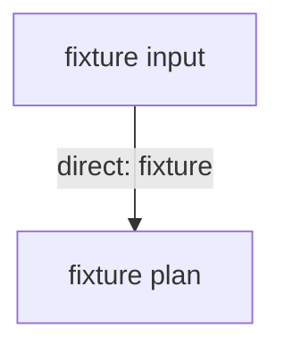

# Sample Large Plan

## At a Glance

- Outcome: large fixture plan with 4 phases.
- Blast radius: fixture.
- Work Plan phases: 4.
- Biggest risk: fixture risk.

## Context

- Large fixture context.

## Verified Facts

- Fixture fact at `package.json:1`.

## Target State

- Fixture target.

## Scope

In scope: fixture work.

Non-goals:

- Fixture out-of-scope item.

## Work Plan

| Phase           | Touches             | Depends on   | Acceptance gate         |
| --------------- | ------------------- | ------------ | ----------------------- |
| P1 Phase 1 work | `src/core/mod-1.ts` | requirements | Phase 1 gate observable |
| P2 Phase 2 work | `src/core/mod-2.ts` | P1           | Phase 2 gate observable |
| P3 Phase 3 work | `src/core/mod-3.ts` | P2           | Phase 3 gate observable |
| P4 Phase 4 work | `src/core/mod-4.ts` | P3           | Phase 4 gate observable |

### P1 — Phase 1 work

- Edit `src/core/mod-1.ts` to add the phase 1 behavior.
- Acceptance gate: phase 1 gate observable.

### P2 — Phase 2 work

- Edit `src/core/mod-2.ts` to add the phase 2 behavior.
- Acceptance gate: phase 2 gate observable.

### P3 — Phase 3 work

- Edit `src/core/mod-3.ts` to add the phase 3 behavior.
- Acceptance gate: phase 3 gate observable.

### P4 — Phase 4 work

- Edit `src/core/mod-4.ts` to add the phase 4 behavior.
- Acceptance gate: phase 4 gate observable.

## Files and Interfaces

- `src/core/mod-1.ts`
- `src/core/mod-2.ts`
- `src/core/mod-3.ts`
- `src/core/mod-4.ts`

## Verification

- P1: `pnpm run test` proves phase 1 gate observable.
- P2: `pnpm run test` proves phase 2 gate observable.
- P3: `pnpm run test` proves phase 3 gate observable.
- P4: `pnpm run test` proves phase 4 gate observable.

## STOP Triggers

- Halt on fixture contradiction.

## Open Questions

- Fixture open question.

## Impact Graph

